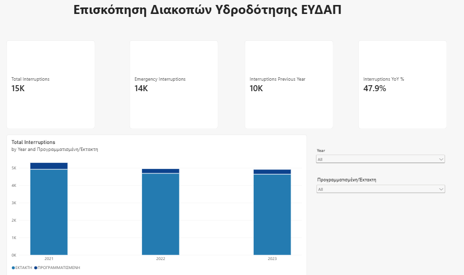
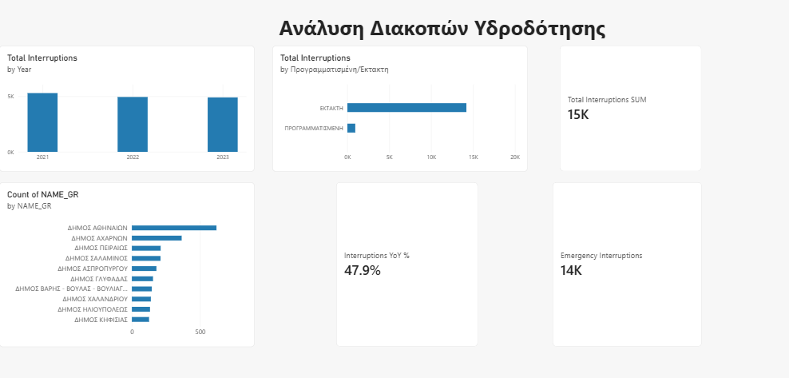
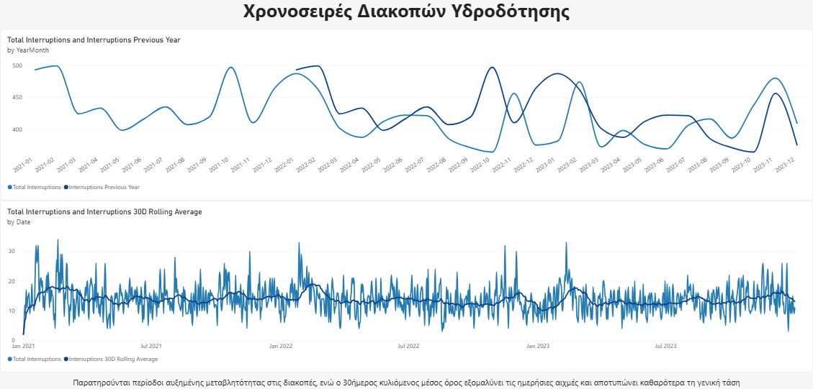
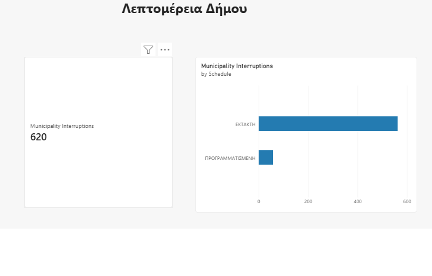
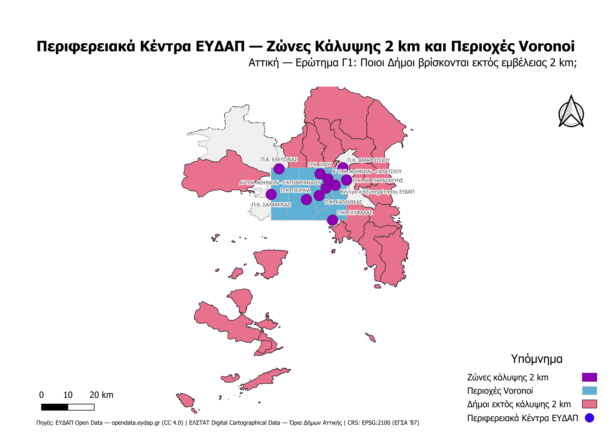

# EYDAP Data Analytics & Geospatial Analysis

End-to-end **Business Intelligence + GIS** portfolio project combining **Power BI, DAX, Power Query and QGIS** to analyze water-supply interruption data and the spatial proximity of EYDAP regional service centers in Attica, Greece.

> Developed as part of the DDI298 course at the Ionian University.

---

## Project Overview

This project combines two complementary analytical workflows:

- **Power BI** for data modeling, KPI tracking, time-based analysis and interactive municipality-level exploration.
- **QGIS** for geospatial analysis of the 11 EYDAP Regional Centers using Voronoi polygons, 2 km buffers and spatial selection.

The goal was to move from raw operational data to an interactive analytical dashboard and then extend the analysis with a geographic perspective.

---

## Key Results

- Approximately **15K recorded water-supply interruptions**
- Approximately **14K emergency interruptions**
- **Athens** recorded approximately **620 interruptions** in the analyzed dataset
- **11 EYDAP Regional Centers** analyzed spatially
- **40 municipalities** identified outside the geometric **2 km coverage zones**

> **Important:** the 2 km result represents geometric proximity only. It does **not** imply that those municipalities are not actually served by EYDAP.

---

## Tech Stack

### Business Intelligence
- Microsoft Power BI
- DAX
- Power Query
- Data Modeling
- Time Intelligence
- Drill-through
- Cross-filtering
- KPI Design

### Geospatial Analysis
- QGIS
- EPSG:2100 — GGRS87 / Greek Grid
- Voronoi Polygons
- 2 km Buffers
- Select by Location
- Spatial Filtering
- Raster Processing

---

## Power BI Dashboard

The Power BI report contains four analytical pages.

### 1. Overview

Executive-level view of the main KPIs, yearly trends and interactive filters.



### 2. Analysis

Municipality-level comparison, interruption type analysis and top affected municipalities.



### 3. Time Analysis

Time Intelligence analysis including Year-over-Year comparison and a 30-day rolling average.



### 4. Municipality Detail

Drill-through page for exploring an individual municipality and its interruption profile.



---

## Geospatial Analysis

The QGIS workflow used the 11 EYDAP Regional Centers as point features and evaluated their spatial relationship with municipalities in Attica.

### Workflow

1. Import Regional Center coordinates
2. Reproject points from **EPSG:4326** to **EPSG:2100**
3. Generate **Voronoi polygons**
4. Create **2 km buffers**
5. Use **Select by Location** against Attica municipalities
6. Invert the selection to identify municipalities outside all 2 km buffers
7. Export the resulting spatial layer
8. Produce the final cartographic layout

### Spatial Result

The analysis identified:

- **31 municipalities/entities intersecting at least one 2 km buffer**
- **40 municipalities/entities outside all 2 km buffers**

The Voronoi polygons model nearest-center geometry, while the buffers model simple Euclidean proximity.



---

## Repository Structure

```text
powerbi-qgis-eydap-analysis/
│
├── README.md
│
├── screenshots/
│   ├── 01_overview.png
│   ├── 02_analysis.png
│   ├── 03_time_analysis.png
│   ├── 04_municipality_detail.png
│   └── 05_qgis_map.png
│
├── powerbi/
│   └── dashboard.pbix
│
├── qgis/
│   ├── project.qgz
│   ├── layers.gpkg
│   └── map_print.pdf
│
└── docs/
    └── analysis_methodology.pdf
```

---

## Data Sources

The project uses data from:

- **EYDAP Open Data** — water-supply interruption and Regional Center data
- **Hellenic Statistical Authority (ELSTAT)** — administrative boundaries / population-related supporting data
- **Course-provided DEM raster data** for the geospatial component

Raw course files and large raster datasets are intentionally not redistributed in this repository.

---

## How to Explore the Project

### Power BI

Download:

```text
powerbi/dashboard.pbix
```

Open it using **Power BI Desktop**.

### QGIS

Download:

```text
qgis/project.qgz
qgis/layers.gpkg
```

Open the project using **QGIS 3.x**.

The final exported map is available at:

```text
qgis/map_print.pdf
```

---

## Analytical Limitations

This project should be interpreted as an exploratory analytical workflow.

- A 2 km buffer represents **straight-line geometric distance**, not road-network distance or travel time.
- Voronoi polygons represent **nearest-point geometry**, not official EYDAP service jurisdictions.
- Municipality intersection with a buffer is a geometric criterion and does not measure service quality or actual accessibility.

A future extension could incorporate:

- road-network travel time
- population weighting
- interruption frequency per capita
- service demand
- additional operational or customer-service indicators

---

## What I Learned

This project strengthened my experience with the full analytics workflow:

**data preparation → modeling → DAX → dashboard design → interactive analysis → GIS processing → spatial interpretation → visual communication**

It also demonstrated how **Business Intelligence and GIS** can complement each other when operational data has a geographic dimension.

---

## Author

**Spyridon Lagouderis**  
Informatics Student — Ionian University

### Core Skills Demonstrated

`Power BI` `DAX` `Power Query` `Data Modeling` `Data Visualization` `Business Intelligence` `QGIS` `GIS` `Spatial Analysis`

---

## License / Data Notice

This repository is intended for educational and portfolio purposes.  
Third-party datasets remain subject to the terms and licenses of their respective providers.
